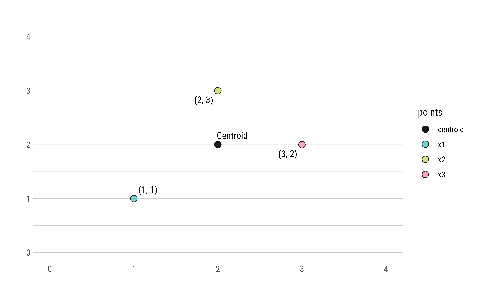

```{r setup, include=FALSE}
knitr::opts_chunk$set(echo = FALSE, warning = FALSE, message = FALSE, out.width = "80%")
library(kableExtra)
library(knitr)
library(ggplot2)
library(hrbrthemes)
library(lubridate)
library(GGally)
library(ggrepel)

source("data.R")
```


<script src="assets/min.js"></script>
<script src="//cdnjs.cloudflare.com/ajax/libs/highlight.js/9.12.0/highlight.min.js"></script>
<script src="assets/pymin.js"></script>
<script>hljs.initHighlightingOnLoad();</script>


<span class = "myhighlight">Overview:</span> Using Python, we implement a program to process and analyze data for Pokémon Go, an augmented-reality video game played by hundreds of millions of people. The problems in this assessment focus on providing descriptive statistics for summarizing the Pokémon dataset.


## Background


K-means clustering is a popular machine learning and data mining algorithm that discovers possible clusters within a dataset. Finding these clusters often reveals meaningful information from the data distribution. K-means clustering is used for a number of different applications, such as recognizing hand-written digits, which we will be implementing in this assignment.


### K-Means Clustering Overview

<div class = "roundedlist">
K-means clustering works in four steps:

1. Initialize some number $k$ of cluster centers, also called `centroids`.
2. For each data point in the dataset, assign it to the closest centroid.
3. Update the locations of the centroids to be the average of all the points assigned to that cluster.
4. Repeat steps 2 and 3 until convergence.

</div>


<span class = "myhighlight4"> Note.</span> The data points do not change. Only the locations of the centroids change with each iteration. As the centroids move, the set of data points closest to each centroid changes.


Below is an example of a single run of the K-means clustering.


```{r}
# Step 1. Initial Centroid Placement
# Step 2. Update Assignments
# Step 3. Update Centroid Location
```


As with many machine learning techniques, this algorithm consists of a vast list of terminology which we define in a bit more detail below.


#### Distance


The Euclidean distance, which indicates a straight line, is a simple way to calculate how close a data point is to a centroid. We calculate the euclidean distance using the **Pythagorean theorem**, defined as follows. For two points $a = \left[a_1, a_2, \ldots, a_n\right]$ and $b = \left[b_1, b_2, \ldots, b_n\right]$, where $n$ is the current dimension, we define the euclidean distance between both points as 


$$
\begin{align}
D(a, b) = \sqrt{\left(a_1 - b_1\right)^2 + \left(a_2 - b_2\right)^2 + \ldots + \left(a_n - b_n\right)^2}
\end{align}
$$


<span class = "myhighlight2">Example 1. Distance</span> Consider the two data points from a $3$-dimensional dataset: $x_1 = \left[-2, -1, -4\right]$ and $x_2 = \left[10, -5, 5\right]$. We calculate the distance between $x_1$ and $x_2$ as 


$$
\begin{align}
D(x_1, x_2) &= 
\sqrt{(-2 - 10)^2 + (-1 + 5)^2 + (-4 - 5)^2} = \sqrt{241}
\end{align}
$$


#### Clusters 

A cluster is a collection of points that are part of the same group. For k-means, every point is part of a cluster. So as the algorithm progresses and the centroids shift, points might change which cluster they're grouped in, even though the point itself does not move. 


<span class = "myhighlight2">Example 2. Clusters</span>


```{r}
# blue points = 
# red points = 
# green points = 
```


In the above image, all blue points are grouped in `cluster1`, all red points are grouped in `cluster2`, and all green points are group in `cluster3`.


#### Centroids

A centroid is the center of a cluster. In K-means, we assume that the centroid of a cluster is the average location of all the points in that cluster. This is equivalent to the average of the data points' components in each dimension. So if we have three $n$-dimensional points $a$, $b$, and $c$, we define the average as


$$
\mathit{average} = 
\left[
\frac{a_1 + b_1 + c_1}{3}, \frac{a_2 + b_2 + c_2}{3}, \frac{a_3 + b_3 + c_3}{3}
\right]
$$


<span class = "myhighlight2">Example 3. Centroids</span> Suppose a cluster contains the three $2$-dimensional points $x_1 = \left[1, 1\right]$, $x_2 = \left[2, 3\right]$, and $x_3 = \left[3, 2\right]$. We calculate the centroid for this cluster as $c = \left[\tfrac{1 + 2 + 3}{3}, \tfrac{1 + 3 + 2}{3}\right]$. 


    
```{r}
data_points = data.frame(
  "points" = c("x1", "x2", "x3", "centroid"),
  "label" = c("(1, 1)", "(2, 3)", "(3, 2)", "Centroid"),
  "x" = c(1, 2, 3, 2),
  "y" = c(1, 3, 2, 2))

data_points_plot <- 
  ggplot(data = data_points, mapping = aes(x = x, y = y, label = label)) +
  geom_point(mapping = aes(fill = points), pch = 21, size = 3.25, alpha = 0.9, color = "#030404", stroke = 0.5) +
  geom_text_repel(point.padding = 5, family = "Roboto Condensed", size = 3.75, fontface = "plain") +
  scale_fill_manual(values = c(
    "black", "#61cad1", "#cae278", "#ff99b1",
    # extra colors
    "#F0BE43", "#c757c7", "#ff5370")) +
  theme_ipsum_rc(axis_text_size = 10) + xlim(c(0, 4)) + ylim(c(0, 4)) +
  theme(axis.title.x = element_blank(), axis.title.y = element_blank())


ragg::agg_png(filename = "assets/static/centroid_example.png", width = 7085, height = 4295, units = "px", res = 900)
data_points_plot
invisible(dev.off())

```


The above image is a graphical representation of these three points and their centroids.


#### Convergence


An algorithm converges if the locations of all centroids do not change much between two iterations, e.g. within some threshold of $1 \times 10^{-5}$.


<span class = "myhighlight2">Example 4. Convergence</span> Suppose we have two, $2$-dimensional centroids $c_1 = \left[0.45132, -0.99134\right]$ and $c_2 = \left[-0.34135, -2.3525\right]$.

```python
c1 = [0.45132, -0.99134]
c2 = [-0.34135, -2.3525]
```

After running the next iteration of the algorithm, the centroids are updated as follows.


```python
c1 = [1.43332, -1.9334]
c2 = [-1.78782, -2.3523]
```


We say that the algorithm has NOT converged since the location of the two centroids are very different between iterations. On the other hand, suppose that the new locations of the centroids are instead updated as follows.


```python
c1 = [0.45132, -0.99134]
c2 = [-0.34135, -2.3524]
```


If the new locations of the centroids the above, we say that the algorithm has converged since the locations of the two centroids are very similar between iterations.


-------------------------


### K-Means Clustering Algorithm


The **pseudo code** for the K-means algorithm is as follows.


```
data = Load Data
centroids = Randomly Created K Centroids

while centroids not converged:
  for each data point:
    assign data point to closest centroid
  for each centroid:
    set new centroid location as the mean of
    all points in this cluster
```


The initial frame (step0) is the initialization: two randomly chosen centroids are drawn as an X in blue (centroid 0) and red (centroid 1). In the following steps, (step1 through step6):

- Data points are assigned to whichever centroid is closest (and colored accordingly),
- Centroid locations are adjusted based on the mean of the points assigned to them.


This process is repeated until the centroids do not move anymore. As we progress through the steps, and especially in the later ones, the centroids do not move as much between steps. Throughout the algorithm, the data points never move but they may be assigned to different centroids as they are updated.


-------------------------


## Part 1. The Algorithm


<span class = "myhighlight">Objective.</span> Design and implement a k-means clustering algorithm in Python.


Specifically, we write the K-means clustering algorithm in the `kmeans.py` file and then run the program on various datasets contained in a nearby directory. To implement the algorithm, we work with the data structures `data` and `centroids`.

<div class = "datasource2">
1. `data`: A list of data points, where each data point is a list of numeric float values.
2. `centroids`: A dictionary of centroids, where the keys are strings (centroid names) and the values are lists (centroid locations).

</div>


For example, consider the following data structures.


$$
\begin{align}
&\mathbb{data} =
\left[\small{
\left[0.34, -0.2, 1.13, 4.3 \right], 
\left[5.1, -12.6, -7, 1.9 \right], 
\left[-15.6, 0.06, -7.1, 11.2 \right]
}\right] 
\\
&\mathbb{centroids} = 
\left\{\small{
\begin{aligned}
&\texttt{centroid1}:
\left[1.1, 0.2, -3.1, -0.4\right], 
&\texttt{centroid2}: 
\left[9.3, 6.1, -4.7, 0.18\right]
\end{aligned}
}\right\}
\end{align}
$$


Here, data contains three data points, where each data point is four-dimensional. And centroids contains two key-value pairs, which will eventually be updated with new locations.


 You will only be working in kmeans.py for Part 1. Here is a brief overview of the steps, which are described below:

Implement euclidean_distance(), which will calculate the distance between two points.
Implement get_closest_centroid(), which allows you to find the closest centroid for a point.
Implement update_assignment(), which sets the centroid assignment for a point.
Implement mean_of_points(), which calculates the mean of a list of points. Also, implement update_centroids(), which will update all of the centroids to the new mean of the points assigned to them.
Run the entire algorithm!
Check code quality


-------------------------


## Part 2. Analysis


-------------------------


